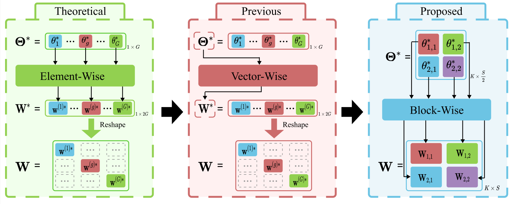
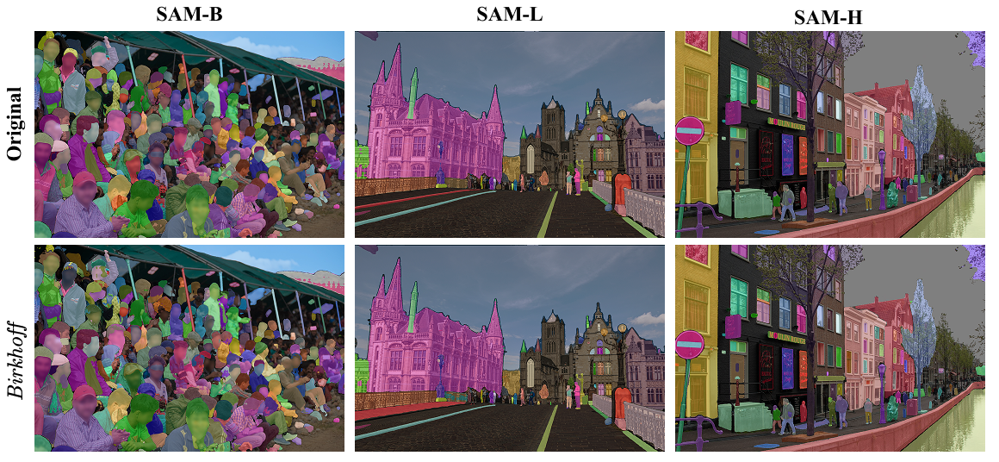
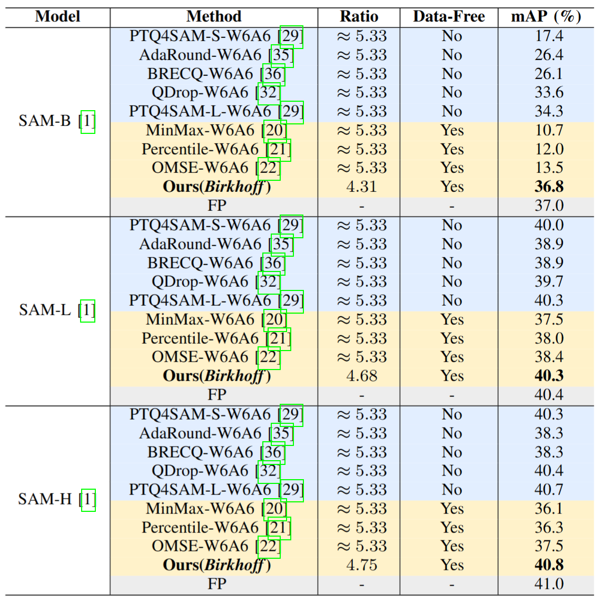
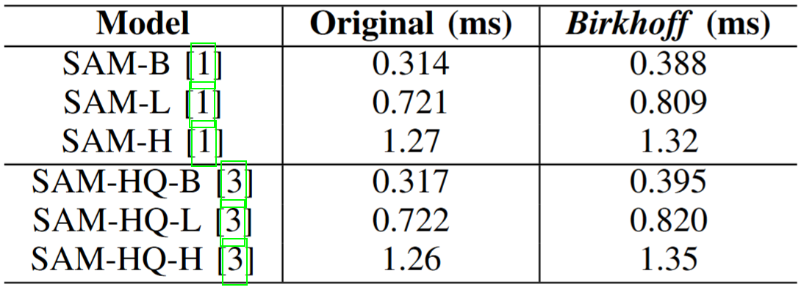

## 《Compress Any Segment Anything Model (SAM)》

   

[📄[paper](-)] [📍[Github](https://github.com/Juntongkuki/Birkhoff-Model-Compression)]


## News 📢 
* **2025/06/18** : Big day! 🥰 Our **Birkhoff** code has officially gone open source. ✨ We'll be pushing updates as the saga continues. Thanks for watching, supporting! 😄 Moreover, welcome to read our previous work [**《Hyper-Compression: Model Compression via Hyperfunction》**](https://github.com/Juntongkuki/Hyper-Compression.git), which is the theoretical foundation of **Birkhoff**.


## Introduction
Due to the excellent performance in yielding high-quality, zero-shot segmentation, Segment Anything Model (SAM) and its variants have been widely applied in diverse scenarios such as healthcare and intelligent manufacturing. Therefore, effectively compressing SAM and its variants has become an increasingly pressing practical need. Unlike quantization, pruning, distillation, and low-rank decomposition, we propose *Birkhoff* algorithm for systematically compressing SAM and its variants. Specifically, *Birkhoff* introduces a novel compression algorithm: Hyper-Compression, whose core principle is to find a dense trajectory to turn a high-dimensional parameter vector into a low-dimensional scalar. Furthermore, *Birkhoff* designs a dedicated linear layer operator, HyperLinear, to fuse decompression and matrix multiplication to significantly accelerate inference of the compressed SAMs. *Birkhoff* is a universal, data-free, fast, and high-accuracy-compression-ratio compression algorithm. Extensive experiments on 18 SAMs in the COCO, LVIS, and SA-1B datasets show that *Birkhoff* performs consistently and competitively in compression time, compression ratio, post-compression performance, and inference speed. For example, *Birkhoff* can achieve a compression ratio of 5.17× on SAM2-B, with less than 1% performance drop without using any fine-tuning data. Moreover, the compression is finished within 60 seconds for all models.


<div align="center">
  
</div>
<p align="center"><b>Fig. </b> Overview of our Birkhoff compression framework.</p>


### The proposed *Birkhoff* enjoys the following merits: 💡

* **V**ersatility across model types 

* **A**gility in model deployment

* **F**aithfulness to the original model

* **C**ompactness in model size


## 🥳 *Birkhoff* 🍾
### HyperLinear Operator
The previous [Hyper-Compression](https://github.com/Juntongkuki/Hyper-Compression.git) is vector-wise, which is incompatible with the matrix product in GPU acceleration that is “block-wise" operated. Therefore, Hyper-Compression needs to decompress the entire matrix first before doing the matrix product, which has large room for improvement. In the *Birkhoff* algorithm, we design a “block-wise" compression and decompression, respectively. Then, we further propose **Hyperlinear** to fuse decompression and matrix product, which can greatly expedite the inference because linear layers including Q, K, V attention modules usually dominate SAM.

<div align="center">
  
</div>
<p align="center"><b>Fig. </b> Technical evolution of decompression: from theoretical element-wise operation to vector-wise operation, and finally to our proposed block-wise one (HyperLinear) to facilitate operator fusion.</p>


### Segment Everything Visualization
Visualization comparisons indicate that *Birkhoff*-compressed model preserves the boundaries of masks to such an extent that virtually no noticeable visual differences from those of the original models are discernible.
<div align="center">
  
</div>
<p align="center"><b>Fig. </b> We select SAM-B, SAM-L, and SAM-H for a visual comparison of the Segment Everything task before and after Birkhoff compression.</p>


### Compression Performance
This whole [table](assets/performance.pdf) is the accuracy and sizes (MB) of 18 SAMs and their corresponding *Birkhoff*-compressed versions on three datasets (COCO, LVIS, and SA-1B). For example, the following tables illustrate the results of SAM-B, SAM-L, SAM-H: 
<div align="center">
  
</div>


### Compression Time and Ratio
The majority of models can be fully compressed within 60 seconds. In terms of the compression ratio, most models can be compressed by more than 4.3×, with the highest ratio reaching 5.17×. Even for variants such as EdgeSAM, MobileSAM, and SAM-HQ-Tiny, which have little remaining compressibility after distillation from SAM, our method can still achieve the compression ratios in excess of 3.3×.
<div align="center">
  
</div>
<p align="center"><b>Fig. </b> The compression time and achieved compression ratios for 18 SAMs using Birkhoff.</p>


### Comparison with Other Data-Free Compression Methods
We compare our *Birkhoff* with other data-free methods, including MinMax, Percentile, and OMSE, and fine-tuning-based methods, such as PTQ4SAM, AdaRound, BRECQ and QDrop. The following table presents a comparison of the mAP scores before and after compressing SAM-B, SAM-L, SAM-H models on the COCO dataset using box prompts. Although *Birkhoff* currently does not exceed the compression ratio of the INT6 quantization, it demonstrates compelling merits under stringent constraints: compressing without fine-tuning datasets while rendering almost lossless compression.
<div align="center">
  
</div>
<p align="center"><b>Fig. </b> Image segmentation results (mAP) on COCO dataset using box prompts obtained from objection detection results produced by YOLOX.</p>

### Inference Time
We evaluate the inference speed of the models before and after replacing the HyperLinear operator. As shown in Table, we conduct comparative experiments on six different models, randomly using a small subset of the SA-1B dataset to measure the average inference time per segmentation. The results indicate that, although the inference speed slightly decreases after incorporating the HyperLinear operator, the performance gap is minimal and barely noticeable to human perception. The data further illustrates that the larger the model, the smaller gap in inference. For example, in the case of SAM-H, the inference speed decreases by only 3.94%. This is attributed to the nature of our method, where a single-memory access allows the decoding of two parameters, thereby improving the L2 cache hit rate of the operator. For smaller models, most parameters can be accessed directly from registers, ensuring fast memory access. However, for larger models, our method becomes increasingly beneficial by improving the efficiency of memory access. Moreover, we emphasize that though the *Birkhoff*-compressed SAMs still infer more slowly than the original, their differences are at the level of ms, which shall not hurt the user experience.
<div align="center">
  
</div>
<p align="center"><b>Fig. </b> Comparison of inference time between the compressed model and the original.</p>


## Requirements
The code requires `python>=3.8.0` and we use `torch==2.4.0` and `torchvision==0.19.0`. For the usage of **HyperLinear** operator, `triton==3.0.0` is also required.  
- python == 3.8.0
- torch==2.4.0
- torchvision==0.19.0
- albumentations==2.0.8
- numpy==1.24.3
- safetensors==0.5.3
- triton==3.0.0

## Usage

1. Download the [checkpoint](https://drive.google.com/file/d/192zoxFf5MUELdUzFCgcv4l52wFKmq9pa/view?usp=drive_link) of SAM-HQ-H into the directory of *./sam_family/checkpoints/*.

2. Run the demo code for compressing SAM-HQ-H.

```
python main.py --mode='encode' --model_name='sam_hq_vit_h' --checkpoint_path='/home/ET/jtfan/MyData/checkpoints/sam_hq_vit_h.pth'
```

3. Run the demo code for segment everything task, the results will be saved into *./test_data/seg_results*.
```
python main.py --mode='inference' --model_name='sam_hq_vit_h'
```


## Acknowledgements
We thank the following projects: [SAM](https://github.com/facebookresearch/segment-anything), [SAM2](https://github.com/facebookresearch/sam2.git), [SAM-HQ](https://github.com/SysCV/sam-hq.git), [MobileSAM](https://github.com/ChaoningZhang/MobileSAM), [MobileSAMv2](https://github.com/ChaoningZhang/MobileSAM.git), [EdgeSAM](https://github.com/chongzhou96/EdgeSAM.git), [EfficientSAM](https://github.com/yformer/EfficientSAM.git), [TinySAM](https://github.com/xinghaochen/TinySAM.git), [MedSAM](https://github.com/bowang-lab/MedSAM.git).

[//]: # (## Citation)

[//]: # (```bibtex)

[//]: # (@article{})

[//]: # (```)

## License

This project is licensed under <a rel="license" href="License.txt"> Apache License 2.0</a>. Redistribution and use should follow this license.