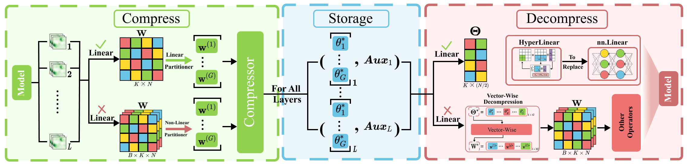

## 《Compress Any Segment Anything Model (SAM)》

   

[📄[paper](-)] [📍[Github](https://github.com/Juntongkuki/Birkhoff-Model-Compression)]

Due to the excellent performance in yielding high-quality, zero-shot segmentation, Segment Anything Model (SAM) and its variants have been widely applied in diverse scenarios such as healthcare and intelligent manufacturing. Therefore, effectively compressing SAM and its variants has become an increasingly pressing practical need. Unlike quantization, pruning, distillation, and low-rank decomposition, we propose *Birkhoff* algorithm for systematically compressing SAM and its variants. Specifically, *Birkhoff* introduces a novel compression algorithm: Hyper-Compression, whose core principle is to find a dense trajectory to turn a high-dimensional parameter vector into a low-dimensional scalar. Furthermore, *Birkhoff* designs a dedicated linear layer operator, HyperLinear, to fuse decompression and matrix multiplication to significantly accelerate inference of the compressed SAMs. *Birkhoff* is a universal, data-free, fast, and high-accuracy-compression-ratio compression algorithm. Extensive experiments on 18 SAMs in the COCO, LVIS, and SA-1B datasets show that *Birkhoff* performs consistently and competitively in compression time, compression ratio, post-compression performance, and inference speed. For example, *Birkhoff* can achieve a compression ratio of 5.17× on SAM2-B, with less than 1% performance drop without using any fine-tuning data. Moreover, the compression is finished within 60 seconds for all models.

  

### 💡The proposed *Birkhoff* enjoys the following merits: 

* **V**ersatility across model types 

* **A**gility in model deployment

* **F**aithfulness to the original model

* **C**ompactness in model size

